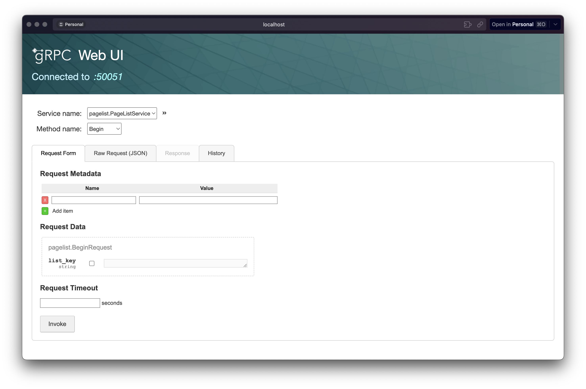

# page-list-service

這是一個使用 Go 語言實現的微服務，提供了文章列表查詢和編輯的功能。

## 特色功能

- **鏈結串列（Linked List）結構**：採用鏈結串列結構來管理文章列表，使資料操作更靈活，並為管理員提供完整的編輯功能，無須擔心傳統分頁帶來的額外負擔。
- **gRPC 通訊**：透過 gRPC 實現高效、低延遲的服務間通訊，確保資料傳輸快速且穩定。
- **輕量級容器化部署**：利用 Docker 將應用容器化，打包後的 image 僅 90MB，減少資源消耗並加速部署流程。

> 專案想法參考了這篇[文章](https://medium.com/dcardlab/de07f45295f6)

## 專案元件

RESTful API： 允許使用者使用 key 擷取文章清單與個別文章資訊。
gRPC API ： 提供管理員強大的編輯操作，包括建立、刪除、修改清單及其元素。
GUI ： 編輯文章清單的友善使用者介面，與 gRPC API 相輔相成。

## 使用的技術

Go：主要程式語言。
PostgreSQL：資料庫，透過 GORM 函式庫進行操作。
Docker：用於容器化部署。
Fiber：高效能的網頁框架。
gRPC：用於服務間高效率、高效能的通訊。

### Demo

服務部署在 [fly.io](https://fly.io/) 上，您可以直接訪問以下連結：

- RESTful API：
  - [page-list-service.fly.dev/api/head/\<key\>](https://page-list-service.fly.dev/api/head/*)
  - [page-list-service.fly.dev/api/page/\<key\>](https://page-list-service.fly.dev/api/page/*)
- gRPC API：
  - [page-list-service.fly.dev/grpc](https://page-list-service.fly.dev/grpc)
- GUI：
  - [page-list-service.fly.dev](https://page-list-service.fly.dev)



## 如何使用

環境需求：

- Go 1.20

### 1. 初始化 env

請參考 `.env.example` 以對 `.env` 進行設定。

### 2. 啟動服務

執行以下指令以啟動所有服務：

```bash
docker-compose up -d
```

### 3. 服務端口

| service     | port  |
| ----------- | ----- |
| RESTful API | 3000  |
| gRPC API    | 50051 |
| GUI         | 8080  |

## 測試

本專案包含使用 [stretchr/testify](https://pkg.go.dev/github.com/stretchr/testify) 和 [container/list](https://pkg.go.dev/container/list) 進行的全面測試。

## API 文件

### RESTful

RESTful API 讓使用者可以透過 key 獲取文章列表及每一篇文章的資訊

#### GET `/api/head/<listkey>`

獲得文章列表中第一篇文章的 key。

Response:

```json
{
  "nextPageKey": "xxx"
}
```

#### GET `/api/page/<pagekey>`

獲得文章資訊及下一篇文章的 key。

Response:

```json
{
  "article": {
    "title": "xxx",
    "content": "xxx",
    "slug": "xxx",
    "published": true
  },
  "nextPageKey": "xxx"
}
```

### gRPC

gRPC API 提供管理員對列表進行編輯的功能。

- New: 建立一個新的列表
- Delete: 刪除一個列表
- Begin: 獲取第一個元素的 Iterator
- End: 獲取最後一個元素之後的 Iterator
- Clear: 清空列表
- Insert: 於該 Iterator 之前插入新的元素
- Erase: 移除該 Iterator
- Set: 設定該 Iterator 儲存的 Page ID
- PushBack: 列表尾部新增一個元素
- PopBack: 移除列表尾部的元素
- PushFront: 列表首部新增一個元素
- PopFront: 移除列表首部的元素
- Clone: 複製一個列表

> TODO: 這部分可以使用 gRPC Bidirectional Streaming 進行優化，讓編輯操作的效率更高。

#### Message

```protobuf
message Empty {

}

message PageList {
  string key = 1;
}

message PageIterator {
  string key = 1;
  uint32 page_id = 2;
}

message DeleteRequest {
  string list_key = 1;
}

message BeginRequest {
  string list_key = 1;
}

message EndRequest {
  string list_key = 1;
}

message NextRequest {
  string iter_key = 1;
}

message PrevRequest {
  string iter_key = 1;
}

message ClearRequest {
  string list_key = 1;
}

message InsertRequest {
  string iter_key = 1;
  uint32 page_id = 2;
}

message EraseRequest {
  string iter_key = 1;
}

message SetRequest {
  string iter_key = 1;
  uint32 page_id = 2;
}

message PushRequest {
  string list_key = 1;
  uint32 page_id = 2;
}

message PopRequest {
  string list_key = 1;
}

message CloneRequest {
  string list_key = 1;
}
```

#### Service

##### New

建立一個新的列表。

```protobuf
rpc New(Empty) returns (PageList) {}
```

##### Delete

刪除一個列表。

```protobuf
rpc Delete(DeleteRequest) returns (Empty) {}
```

##### Begin

獲取第一個元素的 Iterator。

```protobuf
rpc Begin(BeginRequest) returns (PageIterator) {}
```

##### End

獲取最後一個元素之後的 Iterator。

```protobuf
rpc End(EndRequest) returns (PageIterator) {}
```

##### Next

獲取下一個元素的 Iterator。

```protobuf
rpc Next(NextRequest) returns (PageIterator) {}
```

##### Prev

獲取上一個元素的 Iterator。

```protobuf
rpc Prev(PrevRequest) returns (PageIterator) {}
```

##### Clear

清空列表。

```protobuf
  rpc Clear(ClearRequest) returns (Empty) {}
```

##### Insert

於該 Iterator 之前插入新的元素。

```protobuf
rpc Insert(InsertRequest) returns (PageIterator) {}
```

##### Erase

移除該 Iterator。

```protobuf
rpc Erase(EraseRequest) returns (PageIterator) {}
```

##### Set

設定該 Iterator 儲存的 Page ID。

```protobuf
rpc Set(SetRequest) returns (PageIterator) {}
```

##### PushBack

列表尾部新增一個元素。

```protobuf
rpc PushBack(PushRequest) returns (PageIterator) {}
```

##### PopBack

移除列表尾部的元素。

```protobuf
rpc PopBack(PopRequest) returns (Empty) {}
```

##### PushFront

列表首部新增一個元素。

```protobuf
rpc PushFront(PushRequest) returns (PageIterator) {}
```

##### PopFront

移除列表首部的元素。

```protobuf
rpc PopFront(PopRequest) returns (Empty) {}
```

##### Clone

複製一個列表。

```protobuf
rpc Clone(CloneRequest) returns (PageList) {}
```
